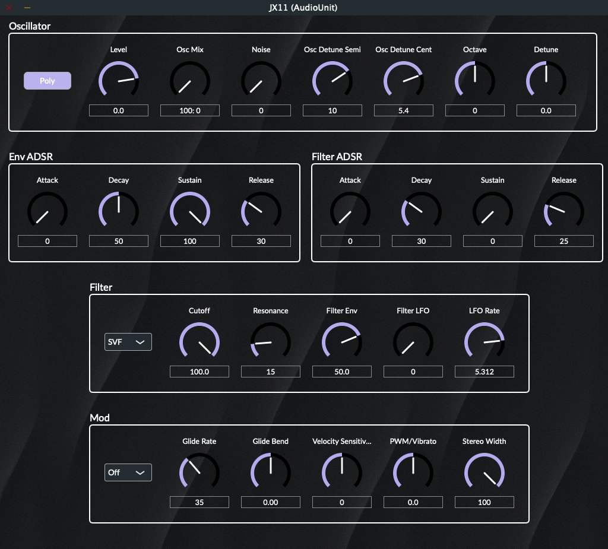

## JX11 Synthesizer

This is the source code of the synthesizer JX11, which I implemented following and studying the book "Creating Synthesizer Plug-Ins with C++ and JUCE" by Matthijs Hollemans.

## Juce dependency

- Clone Juce repository from [github](https://github.com/juce-framework/JUCE)
- Modify your local path in CmakeList.txt: `add_subdirectory("/your/local/path/JUCE" JUCE)`

## Generating IDE project

Xcode: `cmake -G Xcode -B build`

Visual Studio: `cmake -B Build -G "Visual Studio 17"`

## Building

To build the generated IDE project from the command line, run:

`cmake --build Build --config Debug`

### References

- Original repository: https://github.com/hollance/synth-plugin-book
- Book: https://www.theaudioprogrammer.com/synth-plugin-book
